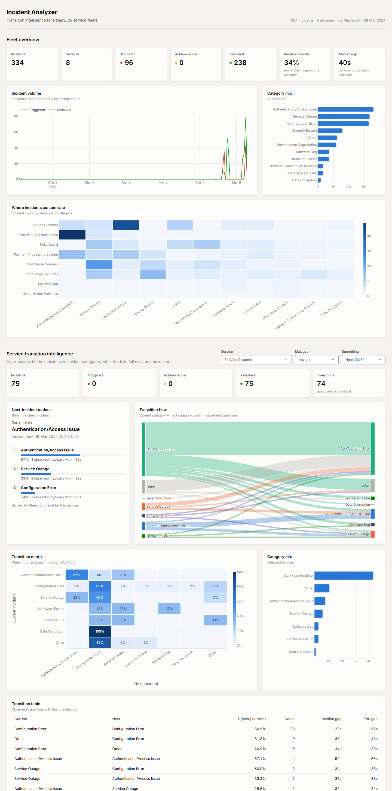
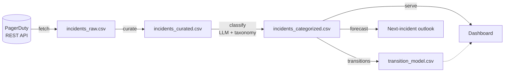

# Incident Analyzer

**Know what breaks next.** Incident Analyzer turns a PagerDuty incident stream into a per-service model of how failures follow one another. For any service it can tell you which incident type is most likely to come next and how soon it usually arrives.

[](https://github.com/NitinReddy-A/Incident-Analyzer/actions/workflows/ci.yml)




---

## Why

Most incident tooling counts things: incidents per service, MTTR, pages per week. That tells you *what already broke*. In a microservice estate, though, incidents are rarely independent. A configuration push is followed by an auth failure. Disk pressure turns into an outage. Within a service, one failure mode tends to lead into the next.

Incident Analyzer models that sequence directly. It ingests incidents from PagerDuty, removes noise, maps each incident onto a closed taxonomy with an LLM, and fits a **service-scoped, time-aware Markov transition model**. The output is a ranked outlook per service that on-call engineers can act on ("Payment Processing just had an *Authentication/Access Issue*; 43% of the time the next page is another one, typically within 44 seconds"). The model is also exportable for downstream tooling.

## Highlights

- **Transition forecasting.** Estimates P(next category | current category) for every service, plus the inter-arrival time for each transition (mean, median, P90).
- **Temporal gating.** An optional `max_gap` ignores incident pairs that are too far apart to be causally related.
- **Additive smoothing.** Laplace or Lidstone smoothing for sparse services, so unseen transitions are not treated as impossible.
- **Closed-taxonomy LLM classification.** Runs at temperature 0, and every label is snapped to the canonical taxonomy, so model drift cannot corrupt the state space.
- **Noise curation.** Drops payload-less pages, heartbeats and duplicate snapshots before they skew the statistics.
- **Interactive dashboard.** Fleet overview, service × category heatmap, transition Sankey, transition matrix, next-incident outlook and transition tables.
- **Fine-tuning corpus tooling.** Repairs, de-duplicates and leak-checks an SFT dataset for training a domain-specific classifier.
- **One CLI, one config surface.** Everything runs through `incident-analyzer <command>`, and all secrets come from the environment.

## How it works



| Stage | Module | What it does |
|---|---|---|
| **Ingest** | `ingest.py` | Paginates `/incidents` (oldest first) with retry and `Retry-After` handling, and flattens incidents to the canonical schema. |
| **Curate** | `curation.py` | Keeps the latest snapshot of each incident and drops incidents without a payload. |
| **Classify** | `classify.py`, `taxonomy.py` | Zero-shot (or fine-tuned) LLM classification constrained to a closed taxonomy, with deterministic label normalisation. Resumable. |
| **Model** | `transitions.py` | Fits the per-service transition model, its delay statistics and the forecasts. |
| **Explore** | `dashboard/` | Dash application built on the same model, with all parameters adjustable live. |

## The transition model

Each service *s* is treated as an independent first-order Markov chain whose states are incident categories. Incidents in *s* are ordered by creation time, and every consecutive pair (x<sub>t</sub>, x<sub>t+1</sub>) is one observed transition. The model estimates

$$
P(x_{t+1}=j \mid x_t=i,\ s) \;=\; \frac{n_{s,ij} + \alpha}{n_{s,i\cdot} + \alpha K_s}
$$

where *n<sub>s,ij</sub>* counts *i → j* transitions inside *s*, *n<sub>s,i·</sub>* counts all transitions leaving *i*, *K<sub>s</sub>* is the number of categories observed in *s* and *α* is the smoothing constant (0 gives the maximum-likelihood estimate). Each transition also stores the distribution of the delay Δt = t<sub>t+1</sub> − t<sub>t</sub>, so the model answers both *what* comes next and *when*.

Three design decisions matter:

1. **Transitions are formed inside each service, never across the global stream.** Real exports interleave services. If you scan adjacent rows in a global export, any pair split by another service's page is lost. On the bundled sample that naive scan finds only 228 of the 326 true within-service transitions (−30%). The loss is uneven: *Payment Processing System*, which pages concurrently with other services, loses 40 of its 49 transitions, so its statistics would rest on a fifth of the evidence.
2. **Probabilities are conditional, not joint.** The forecast question is "given what just happened here, what happens next?", so each row of a service's matrix sums to 1. The joint share of each transition within its service is also exported as `joint_probability`.
3. **Time is part of the model.** `max_gap` drops pairs whose delay is too long to be plausibly related. The delay statistics turn a ranking into an operational expectation ("typically within 44 s").

When a service's current state has never been seen as the source of a transition, the forecast falls back to the service's base rates and says so (`basis = "prior"`).

### Using it as a library

```python
from datetime import timedelta
import pandas as pd
from incident_analyzer import TransitionModel

incidents = pd.read_csv("data/sample/incidents_categorized.csv")
model = TransitionModel.fit(incidents, max_gap=timedelta(hours=6), smoothing=0.5)

model.table  # tidy table of every transition
model.matrix("Payment Processing System")  # P(next | current) matrix
model.forecast("Payment Processing System")  # ranked next-incident outlook
```

### Output schema (`transition_model.csv`)

| Column | Meaning |
|---|---|
| `service` | Service the transition was observed in |
| `from_category`, `to_category` | Current and next incident category |
| `count` | Number of observed transitions |
| `probability` | P(next \| current, service), smoothed if *α* > 0 |
| `joint_probability` | Share of all transitions in the service |
| `mean_delay_s`, `median_delay_s`, `p90_delay_s` | Inter-arrival time statistics in seconds |

## Quick start

```bash
git clone https://github.com/NitinReddy-A/Incident-Analyzer.git
cd Incident-Analyzer
python -m venv .venv && source .venv/bin/activate   # Windows: .venv\Scripts\activate
pip install -e ".[llm]"

incident-analyzer serve            # dashboard on http://127.0.0.1:8050
```

The repository includes a categorised sample dataset, so the dashboard, `transitions` and `forecast` work immediately with no credentials.

```text
$ incident-analyzer forecast "Payment Processing System"
Service: Payment Processing System
Current: Authentication/Access Issue

  1. Authentication/Access Issue       42.9%  (n=6, transition)  median gap 44s
  2. Configuration Error               21.4%  (n=3, transition)  median gap 46s
  3. Service Outage                    14.3%  (n=2, transition)  median gap 58s
```

### Running against your own PagerDuty account

```bash
cp .env.example .env                 # set PAGERDUTY_API_TOKEN and OPENAI_API_KEY
export INCIDENT_ANALYZER_DATA_DIR=data/live

incident-analyzer fetch --since 2024-01-01T00:00:00Z
incident-analyzer curate
incident-analyzer classify           # add --resume to continue an interrupted run
incident-analyzer transitions --max-gap 6h --smoothing 0.5
incident-analyzer serve
```

## CLI reference

| Command | Purpose | Key options |
|---|---|---|
| `fetch` | Download incidents from PagerDuty | `--since`, `--until`, `--service-id` (repeatable), `-o` |
| `curate` | Remove empty-payload incidents and duplicate snapshots | `-i`, `-o` |
| `classify` | Assign taxonomy categories with an LLM | `--model`, `--resume`, `-i`, `-o` |
| `transitions` | Fit the model and export `transition_model.csv` | `--max-gap`, `--smoothing`, `-i`, `-o` |
| `forecast` | Rank the most likely next incidents for a service | `SERVICE`, `--current`, `-k`, `--max-gap`, `--smoothing` |
| `serve` | Launch the dashboard | `--data`, `--host`, `--port`, `--debug` |
| `finetune-prep` | Clean and format the classifier fine-tuning corpus | `--train`, `--test`, `-o` |

Durations accept `90s`, `15m`, `6h` or `1d`. Run `incident-analyzer <command> --help` for full details.

## Configuration

All configuration comes from environment variables. A `.env` file in the working directory is loaded if present, and real environment variables take precedence. Credentials are only required by the stage that uses them.

| Variable | Used by | Default |
|---|---|---|
| `PAGERDUTY_API_TOKEN` | `fetch` | none (required for `fetch`) |
| `PAGERDUTY_BASE_URL` | `fetch` | `https://api.pagerduty.com` |
| `OPENAI_API_KEY` | `classify` | none (required for `classify`) |
| `INCIDENT_ANALYZER_LLM_MODEL` | `classify` | `gpt-4o-mini` |
| `INCIDENT_ANALYZER_DATA_DIR` | all | `./data/sample` |
| `INCIDENT_ANALYZER_HOST` / `INCIDENT_ANALYZER_PORT` | `serve` | `127.0.0.1` / `8050` |

## Classification and taxonomy

Transition statistics are only meaningful over a closed, stable state space. The classifier is prompted with the canonical taxonomy and runs at temperature 0. Every response then goes through `normalize_category`, which handles case and punctuation, `Category:` prefixes, truncated tokens, known aliases and conservative fuzzy matching. Anything it cannot match confidently becomes `Other`.

```
Authentication/Access Issue · Configuration Error · Service Outage · Security Breach
Performance Degradation · Hardware Failure · Software Bug · Network Connectivity Problem
Disk Capacity Issue · Data Corruption · Other
```

Any OpenAI-compatible chat endpoint works. Set `INCIDENT_ANALYZER_LLM_MODEL` to a fine-tuned model ID to use a domain-specific classifier.

## Fine-tuning corpus

`data/finetune/` holds a supervised fine-tuning corpus of incident descriptions labelled with 35 fine-grained root causes (e.g. *Certificate Expiry*, *Database Connection Pool Exhaustion*, *SQL Injection*). Each record is rendered in an instruction format:

```
###Human:
Categorize the incident: <description>

###Assistant:
<label>
```

`incident-analyzer finetune-prep` rebuilds the corpus:

- It repairs labels damaged by CSV field bleed, where a known label is truncated or has the next record appended.
- It drops fragments it cannot recover and removes duplicate descriptions.
- It removes test rows that also appear in the training split.

The shipped corpus has already been through this process: 1,120 training and 92 held-out examples, with no train/test overlap.

## Deployment

```bash
docker build -t incident-analyzer .
docker run -p 8050:8050 incident-analyzer
```

The image serves the dashboard with gunicorn through the `create_server()` WSGI factory. To serve your own data, mount it and point `INCIDENT_ANALYZER_DATA_DIR` at the mount (`-v $PWD/data/live:/data -e INCIDENT_ANALYZER_DATA_DIR=/data`).

## Project layout

```
incident_analyzer/
├── cli.py            # incident-analyzer entry point
├── config.py         # environment-driven settings
├── schema.py         # canonical incident schema and CSV I/O
├── ingest.py         # PagerDuty REST client
├── curation.py       # noise and duplicate removal
├── taxonomy.py       # canonical categories and label normalisation
├── classify.py       # LLM classification
├── transitions.py    # service-scoped transition model and forecasting
├── analytics.py      # descriptive KPIs and aggregations
├── finetune.py       # SFT corpus repair and formatting
└── dashboard/        # Dash app, figures, theme and stylesheet
data/
├── sample/           # synthetic PagerDuty export (raw + categorised)
└── finetune/         # classifier fine-tuning corpus
tests/                # pytest suite
```

## Development

```bash
pip install -e ".[dev]"
pytest
ruff check . && ruff format --check .
```

## Sample data

All data in this repository is synthetic: it comes from a PagerDuty sandbox with fictional services and generated incident descriptions. It contains no customer or production data.

## Program

Incident Analyzer was developed as the project deliverable for the **HPE CTY'24 Technology Project Partnership Program for Industry Readiness** (February – July 2024). The program recognised the completed project with a Certificate of Appreciation.

<p align="center">
  
</p>

## License

[MIT](LICENSE)
